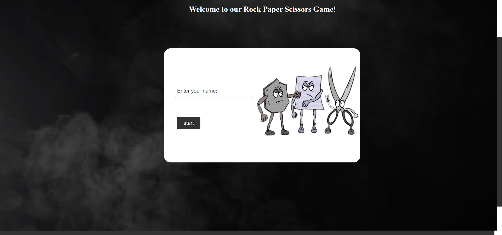
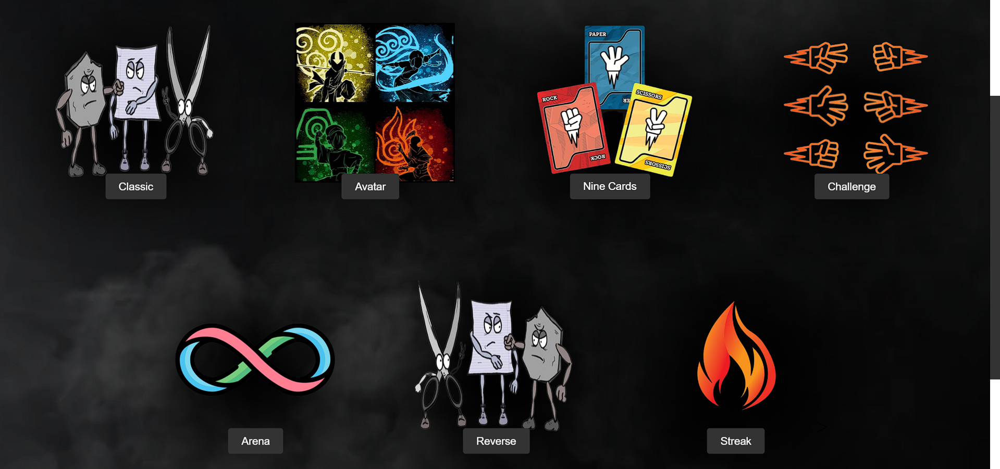
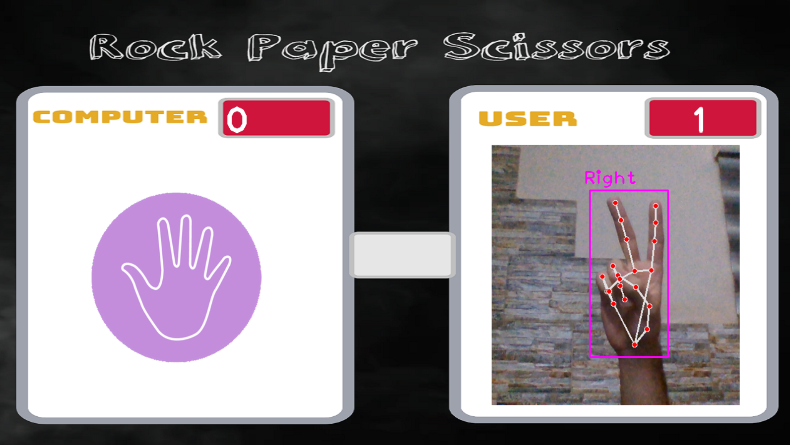
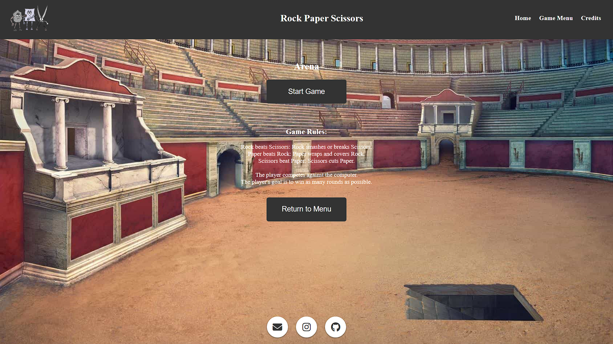
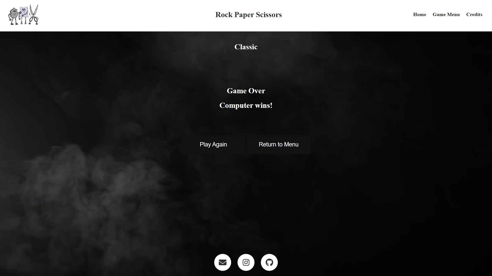

# Rock Paper Scissors

### Team
- Esmail Jawabreh (Team Leader)
- Rakan Almadani
- Doha Khamaiseh
- Dina Jaradat
- Sara Alkhateeb

<br>

---

## Description
#### Rock Paper Scissors is a project developed by our team using the eel framework, which combines Python, JavaScript, HTML, and CSS. The project utilizes various libraries, including Eel, OpenCV (cv2), and cvzone.

<br>
<br>

### The game offers several exciting modes for players to enjoy:

- Classic Mode: 
    #### Play the traditional game of Rock Paper Scissors against the computer.
- Avatar Mode: 
    #### Customize and personalize your in-game avatar while playing Rock Paper Scissors.
- Challenge Mode: 
    #### Test your skills against different difficulty levels and see how far you can go.
- Reverse Mode: 
    #### Experience a twist in the game mechanics, where the traditional hierarchy of Rock Paper Scissors is reversed.
- Nine Cards Mode: 
    #### Play with an expanded set of options, including nine different choices instead of the usual three.
- Arena Mode: 
    #### Compete against comouter in matches with no rounds number.
- Streak Mode: 
    #### Aim for consecutive wins and try to achieve the longest winning streak possible. 

<br>

--- 

#### How to Run

- Clone the project repository from GitHub.
    ```
    git clone https://github.com/Group-05-rockPaperScissors/RPS-eel.git 
    ```
- Install the required dependencies by running:
    ```
    pip install -r requirements.txt
    ```
- Launch the application by executing: 
    ```
    python main.py.
    ```
- Access the game through your web browser at http://localhost:8000.


<br>

--- 

### Dependencies
#### The project relies on the following libraries:

- Eel
- OpenCV (cv2)
- cvzone

#### You can find the complete list of dependencies in the requirements.txt file.

<br>

---

### Feedback and Support
#### If you have any feedback, suggestions, or issues with the game, please feel free to contact our team leader, Esmail Jawabreh, at esmailjawabreh@gmail.com. 
#### We appreciate your support and involvement in making Rock Paper Scissors better.
<br>

#### Thank you for using Rock Paper Scissors! Enjoy the game!

<br>

---

### Screenshots and Videos

#### Game Video

[](https://www.example.com/path_to_video)

<br>

### Screenshots



<br>



<br>



<br>


<br>



<br>



<br>

---